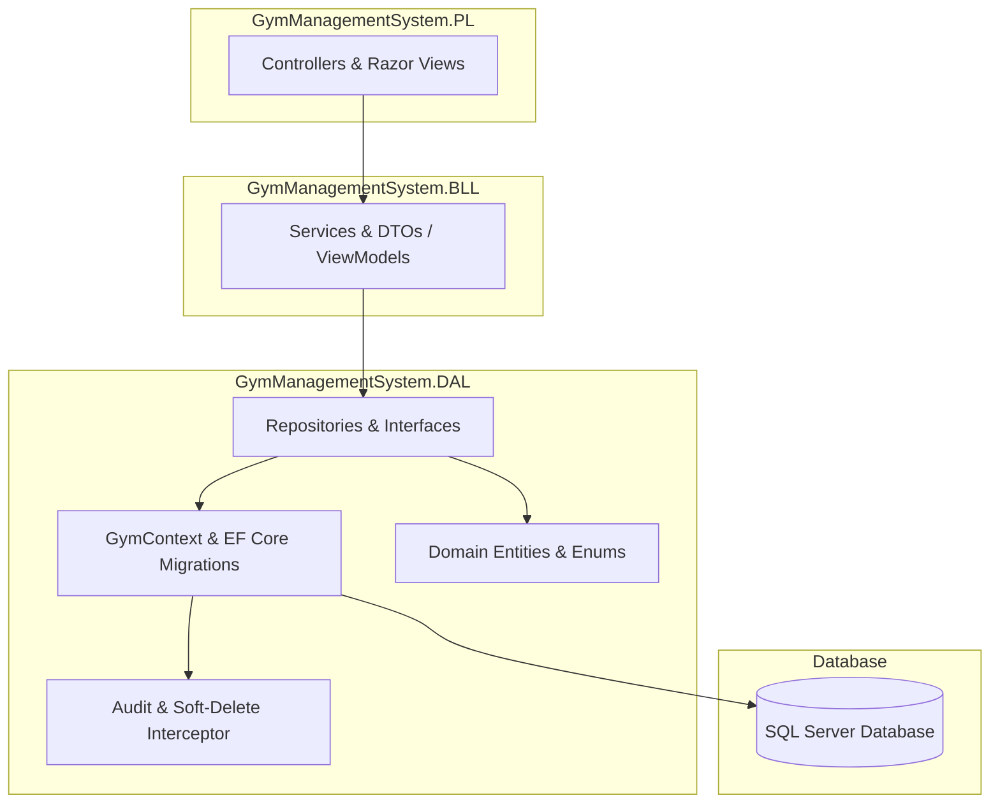

# 🏋️‍♂️ Gym Management System (MVC)

> 📌 **Course Notes & Study Material**:  
> 🔗 **[Notion Notes & Reference Guide 📝](https://www.notion.so/Functions-in-Generic-repository-and-its-overloads-3d056d47682e803c9134ee564d37371f?source=copy_link)**

---

[](https://dotnet.microsoft.com/)
[](https://learn.microsoft.com/en-us/ef/core/)
[](https://www.microsoft.com/sql-server)
[](https://learn.microsoft.com/en-us/dotnet/architecture/)
[](https://learn.microsoft.com/en-us/dotnet/csharp/)

---

## 📖 Table of Contents

- [Overview](#-overview)
- [Key Features](#-key-features)
- [Architecture & Design Patterns](#-architecture--design-patterns)
- [Domain Models](#-domain-models)
- [Tech Stack](#-tech-stack)
- [Getting Started](#-getting-started)
- [Project Structure](#-project-structure)
- [Notes & References](#-notes--references)

---

## 📋 Overview

**Gym Management System** is an enterprise-grade ASP.NET Core MVC application built with **.NET 8.0** and **Entity Framework Core**. It is designed to efficiently manage gym operations, including member subscriptions, trainer schedules, workout sessions, membership plans, health tracking records, and bookings.

---

## ✨ Key Features

- 🏗️ **Clean N-Tier Architecture**: Strict separation of concerns between Data Access (`DAL`), Business Logic (`BLL`), and Presentation (`PL`) layers.
- 🔄 **Generic & Custom Repository Pattern**: Reusable data access logic with type-safe generic repositories and domain-specific operations.
- 🛡️ **EF Core Interceptors (Soft Delete & Automatic Auditing)**: Custom `AuditColumnsInterceptor` automatically tracks `CreatedAt`, `UpdatedAt`, and performs soft deletion (`IsDeleted`, `DeletedAt`).
- 🌱 **Automated Database Seeding & Migrations**: Automatic execution of EF Core migrations and sample data seeding on application startup.
- 👥 **Comprehensive Member Management**: Complete workflow for managing members, membership plans, trainers, and health metrics.
- 📅 **Session & Booking Tracking**: System to organize training sessions, manage schedules, and process bookings.
- 🧩 **Clean Dependency Injection**: Modular service registration extensions (`AddGymManagementSystemDAL` and `AddGymManagementSystemBLL`).

---

## 🏛️ Architecture & Design Patterns

The project follows the **3-Tier / Layered Architecture** to maintain clean code separation, scalability, and maintainability:



### Advanced Patterns Implemented:
1. **Repository Pattern**: `IGenericRepo<T>` and concrete `GenericRepo<T>`, alongside `IMemberRepository` and `IPlanRepository`.
2. **EF Core Interceptor**: `AuditColumnsInterceptor` hooks into EF Core's `SavingChanges` and `SavingChangesAsync` pipeline to manage entity state lifecycle automatically.
3. **Seeder Pattern**: `DataSeeder.SeedDataAsync()` ensures the database has initial data available upon boot.

---

## 🗂️ Domain Models

| Entity | Description |
| :--- | :--- |
| **`Member`** | Stores gym members' profiles, contact info, and health status. |
| **`Trainer`** | Manages trainers' info, specializations, and availability. |
| **`Plan`** | Defines membership packages, pricing, duration, and access tiers. |
| **`Membership`** | Links members to their chosen plan with activation and expiration dates. |
| **`Session`** | Represents training sessions scheduled by trainers. |
| **`Booking`** | Handles session reservations made by members. |
| **`HealthRecord`** | Tracks members' fitness metrics, height, weight, and health history. |
| **`Category`** | Organizes training types and session categories. |
| **`BaseEntity`** | Base entity class providing `Id`, `CreatedAt`, `UpdatedAt`, `IsDeleted`, `DeletedAt`. |

---

## 💻 Tech Stack

- **Framework**: [.NET 8.0](https://dotnet.microsoft.com/) (C# 12)
- **Web App**: ASP.NET Core MVC (Razor Engine, Bootstrap)
- **ORM**: Entity Framework Core 8.0.26
- **Database**: Microsoft SQL Server
- **Tools & Libraries**:
  - `Microsoft.EntityFrameworkCore.SqlServer`
  - `Microsoft.EntityFrameworkCore.Tools`

---

## 🚀 Getting Started

### 1️⃣ Prerequisites
- [.NET 8.0 SDK](https://dotnet.microsoft.com/download/dotnet/8.0) installed.
- [SQL Server / LocalDB](https://www.microsoft.com/sql-server/) installed and running.
- [Visual Studio 2022](https://visualstudio.microsoft.com/) or [VS Code](https://code.visualstudio.com/).

### 2️⃣ Clone the Repository
```bash
git clone https://github.com/Mary-Raafat/GymManagementSystemMVC.git
cd GymManagementSystem
```

### 3️⃣ Configure Database Connection
Open `GymManagementSystem/appsettings.json` and adjust your SQL Server connection string:

```json
{
  "ConnectionStrings": {
    "DefaultConnection": "Server=.;Database=GymManagementSystemDb;Trusted_Connection=True;TrustServerCertificate=True;"
  }
}
```

### 4️⃣ Build & Run
Run the following commands in your terminal or use Visual Studio:

```bash
# Restore dependencies
dotnet restore

# Build the solution
dotnet build

# Run the MVC project (Migrations & Data Seeding run automatically on startup!)
dotnet run --project GymManagementSystem/GymManagementSystem.PL.csproj
```

---

## 📁 Project Structure

```text
GymManagementSystem/
├── 📄 README.md                             # Project Documentation
├── 📄 GymManagementSystemMVC.sln            # Solution File
│
├── 📂 GymManagementSystem/                  # Presentation Layer (ASP.NET Core MVC)
│   ├── 📂 Controllers/                      # MVC Controllers (Member, Plans, Home)
│   ├── 📂 Views/                            # Razor UI Views
│   ├── 📂 wwwroot/                          # Static Assets (CSS, JS, Libraries)
│   └── 📄 Program.cs                        # App Entry Point & Middleware Pipeline
│
├── 📂 GymManagementSystem.BLL/              # Business Logic Layer
│   ├── 📂 Services/                         # Business Services & Contracts
│   ├── 📂 ViewModels/                       # Data Transfer & View Models
│   └── 📄 ServiceCollectionExtensionsBLL.cs  # DI Service Registration
│
└── 📂 GymManagementSystem.DAL/              # Data Access Layer
    ├── 📂 Dbcontexts/                       # GymContext Definition
    ├── 📂 Models/                           # Entity Framework Domain Models
    ├── 📂 Interfaces/                       # Repository Contracts (IGenericRepo, etc.)
    ├── 📂 Repositories/                     # Repository Implementations
    ├── 📂 Interceptors/                     # EF Core Audit & Soft-Delete Interceptor
    ├── 📂 Migrations/                       # Database Migrations
    └── 📄 ServiceCollectionExtensionsDAL.cs  # DAL DI Registration
```

---

## 📝 Notes & References

All comprehensive study notes, course references, and design decisions are organized in Notion:

🔗 **[Click here to view Notion Course Notes](https://www.notion.so/Functions-in-Generic-repository-and-its-overloads-3d056d47682e803c9134ee564d37371f?source=copy_link)**

---

<p align="center">
  Crafted with ❤️ for <b>C# Advanced Course</b>
</p>
